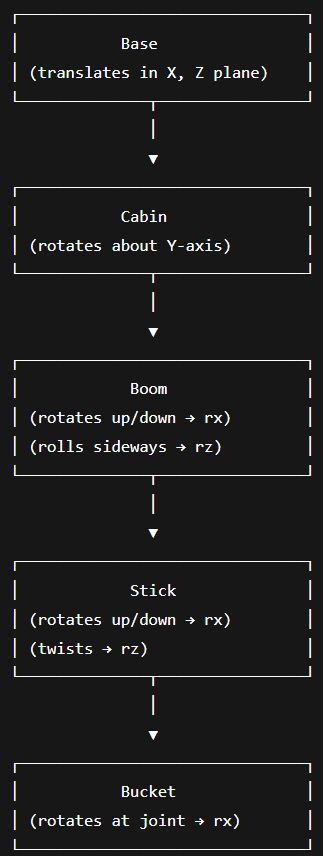
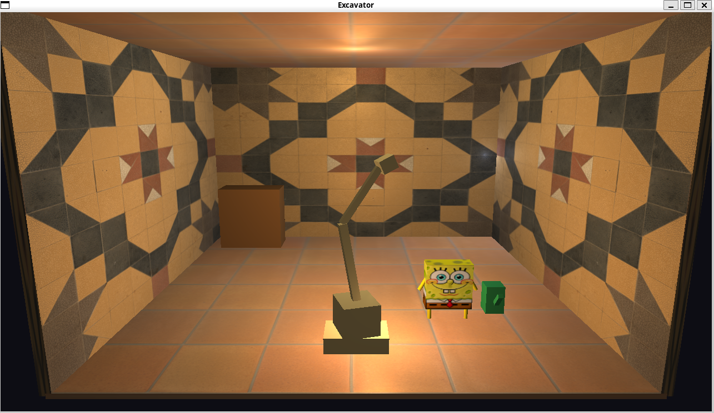
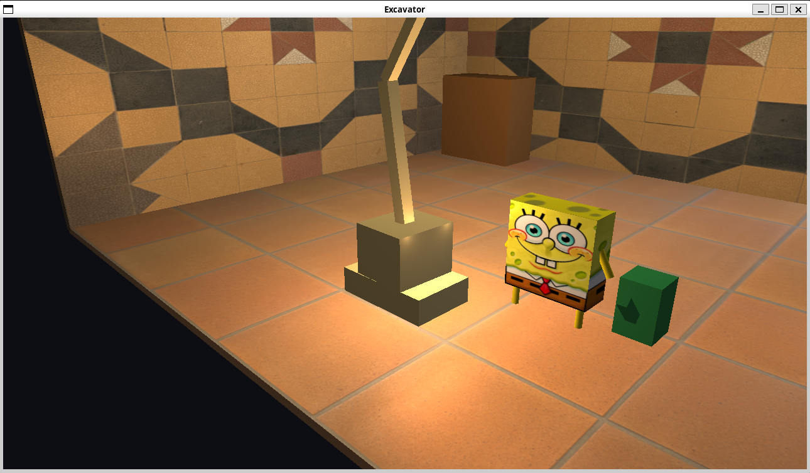

# Assignment 2 – Room Rendering Project (OpenGL)

## Team Members
- *Name 1* – Roll No. 23B1073 Marumamula Venkata Pranay
- *Name 2* – Roll No. 23B0970  Priyanshu Kumar

---

## Declaration
We hereby declare that we have written this assignment code ourselves.  
We have taken conceptual or technical help from the following sources:

### *Sources / References*
- OpenGL official documentation – [https://www.khronos.org/opengl/wiki](https://www.khronos.org/opengl/wiki)
- LearnOpenGL tutorial – [https://learnopengl.com](https://learnopengl.com)
- Some youtube videos

No part of the code has been directly copied from any other student or external repository.

---

## Compilation and Execution

### *Dependencies*
- OpenGL (version ≥ 3.3)
- GLFW
- GLEW

### *Build Instructions*
make && make run

## Keymap

The excavator/camera can be controlled in real time using the following keys:

| **Key(s)** | **Action** |
|-------------|-------------|
| **W / A / S / D** | Move the excavator forward, left, backward, and right respectively on the ground plane. |
| **Q / E** | Rotate the cabin left or right about the vertical (Y) axis. |
| **U / J** | Raise or lower the **boom** (primary arm). |
| **I / K** | Raise or lower the **stick** (secondary arm). |
| **O / L** | Tilt the **bucket** forward or backward. |
| **Y / H** | Twist the **stick** about its longitudinal axis. |
| **T / G** | Roll the **boom** side-to-side. |
| **← / → / ↑ / ↓** | Move **Camera 1** horizontally or vertically. |
| **1** | Toggle Light 1. |
| **2** | Toggle Light 2. |
| **3** | Toggle Excavator’s onboard lights. |
| **C** | Switch between Camera 1 and Camera 2. |
| **ESC** | Exit the program. |

All movement and rotation controls are continuous (while a key is held), while toggles (lights, camera) take effect on a single press.

---

## Hierarchical Structure of the Excavator Model

The excavator model is built using a hierarchical tree structure, where each part is an `HNode` that inherits transformations from its parent.  
The structure is as follows:

## Snapshots

## Story

Spongebob and excavator dance and vibe.